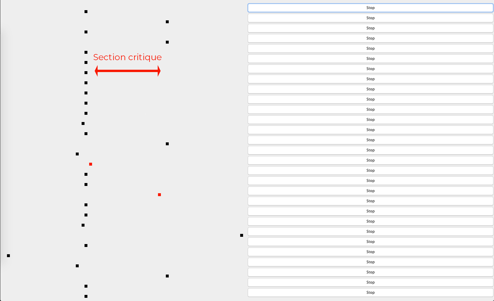

# Compte rendu - Programmation répartie
*Thomas LACAZE DUT Informatique groupe A*

[Github] (https://github.com/LacazeThomas/ProgrammatioRepartie)

##  __01/02/2019 - Thread Java TD/TP N°1__
<u>*Objectif de la séance :</u> Comprendre le but des threads et son application.*

Un processus léger (ou Thread) peut être définie comme le fils d'un processus lourd.  
Les ressources allouées à un processus vont être partagées entre les processus légers qui le composent.  
Un processus possèdent au moins un thread.
Le comportement les processus légers peut changer en fonction de l'OS. Pour éviter ce problème, JAVA propose son propre mécanisme de threads.  

Il permet par exemple : 
* La création de processus.
* La communication entre eux.
* La syncronisation à l'aide de moniteurs.


  
*Diagramme de classe UML succinct*


Voici la classe UneFenetre résumé grossièrement pour afficher l'élément de la classe UnMobile :
``` 
public UneFenetre(){
  super("TP01");
  int LARG=400, HAUT=75; //On définit les largeurs de l'écran
  setSize(LARG,HAUT); //On change la taille de la fenêtre
  setDefaultCloseOperation(EXIT_ON_CLOSE); //Fermeture de la fenêtre si clique
  setVisible(true); //On rend la fenêtre visible

  UnMobile sonMobile = new UnMobile(LARG, HAUT); //On crée un Mobile
  Thread tache = new Thread(sonMobile); //On l'affecte à un thread
  setContentPane(sonMobile) //On affiche à l'écran le Mobile
  tache.start(); //On démarre le thread
}
```
<div style="page-break-after: always;"></div>
Voici la classe UnMobile résumé grossièrement qui permet de faire l'aller retour du carré :

```
public void run(){	
  while (true) {
    ...
    for (sonDebDessin=saLargeur; sonDebDessin >= 0; sonDebDessin-= sonPas){ //Aller de droite à gauche
      repaint(); //On deplace le Mobile en rappellant 'paintComponent'
      try{
          Thread.sleep(sonTemps); //On mets en pause le thread pendant X temps
      }
      catch (InterruptedException telleExcp){
          telleExcp.printStackTrace();
      }
    }
  }
}
```

## __08/02/2019 - Thread Java TD/TP N°3__

<u>*Objectif de la séance :</u> Comprendre le but des sémaphores et son application.*

Un sémaphore permet de donner des ordres de priorité à certaines parties d'un programme lors de l'utilisation de Threads

Il existe deux types de sémaphore : 
* Les sémaphores binaires (mutex) : 1 ou 0.
* Les sémaphores générals: valeurs positives.

Un sémaphore binaire ou classique continue d'excuter la tache si sa valeur est possitive.
```
class Exclusion{}//Exclusion est classe scope est donc commun à tous les ensembles de cette classe
static Exclusion exclusionImpression = new Exclusion (); //Classe scope 
static SemaphoreBinaire sem = new SemaphoreBinaire(1);
```
Ici on crée un Semaphore binaire donc mutex et on l'initialise à 1.
Pour proteger la section critique (partie du code à exécuter dans un certain sens), il suffit le décrémenter la value du mutex pour bloquer les taches qui arrivent: `sem.syncWait()`

Une fois la section passée il suffit de recrémenter le mutex pour le libérer la place aux prochains threads: `sem.syncSignal()`

Il est possible d'afficher des messages d'informations lorsqu'on rentre dans une section critique ou que l'on en sors. Pour cela, lors de la décrementation ou incrémentation un simple:  `System.out.println("J'entre dans une section critique");` suffit.
    
## __08/02/2019 - TP combinaison n°1 et n°3__

<u>*Objectif de la séance :</u> Implémenter une section critique avec semaphore dans le déplacement des objets de la classe UnMobile.*

Enoncé: Diviser l'écran en 3 parties. Celle du milieu étant une section critique. Il doit y avoir uniquement N classe UnMobile présent au maximum.

  
*Diagramme succinct*

Pour cela, il suffit de diviser les deux bloucles `for` en 3 boucles chacune. Ainsi, nous créons un sémaphore pour pouvoir laisser passer N classe UnMobile au milieu de l'écran. Un mutex aurait été possible si on voulais uniquement un objet de la classe UnMobile au milieu. A présent nous décrémentons lors qu'un élément arrive au millieu `sem.syncWait()` et nous informons le sémaphore lorsqu'il sort du millieu `sem.syncSignal()`.  
Pour des raisons pratique le sémaphore n'est pas une classe scope mais est définie dans UneFenetre. Il est envoyé à chaque Thread.
<div style="page-break-after: always;"></div>

Voici un exemple de code succinct: 
``` 
public UneFenetre(){
  super("TP3");
  int N = 10; //Nous voulons 10 threads pouvant passer dans la section critique
  Semaphore sem = new Semaphore(N);
  this.setLayout(new GridLayout(OCU,2));
  for(int i=0;i<OCU;i++){ 
    stop[i] = false;
    sonMobile[i] = new UnMobile(LARG, HAUT,sem);
    sonButton[i] = new JButton("Stop");
    this.getContentPane().add(sonMobile[i]);
    this.getContentPane().add(sonButton[i]);
    tache[i] = new Thread(sonMobile[i]);
    tache[i].start();
    sonButton[i].addActionListener(listener);
  }
    ...
}
```

``` 
public void run(){	
	while (true) {
    ##ALLER
		for (sonDebDessin=0; sonDebDessin <= saLargeur/3; sonDebDessin+= sonPas){
      ...
		}
		sem.syncWait(); //On décrémente le sémaphore. Entrée section critique
				
    for (sonDebDessin= saLargeur/3; sonDebDessin <= saLargeur/3*2; sonDebDessin+= sonPas){
		  ...
		}
			
    sem.syncSignal(); //On incrémente le sémaphore. Sortie section critique
				
    for (sonDebDessin= saLargeur/3*2; sonDebDessin <= saLargeur/3*3; sonDebDessin+= sonPas){
			...
		}

    ##RETOUR - Même opération
	}
}
``` 